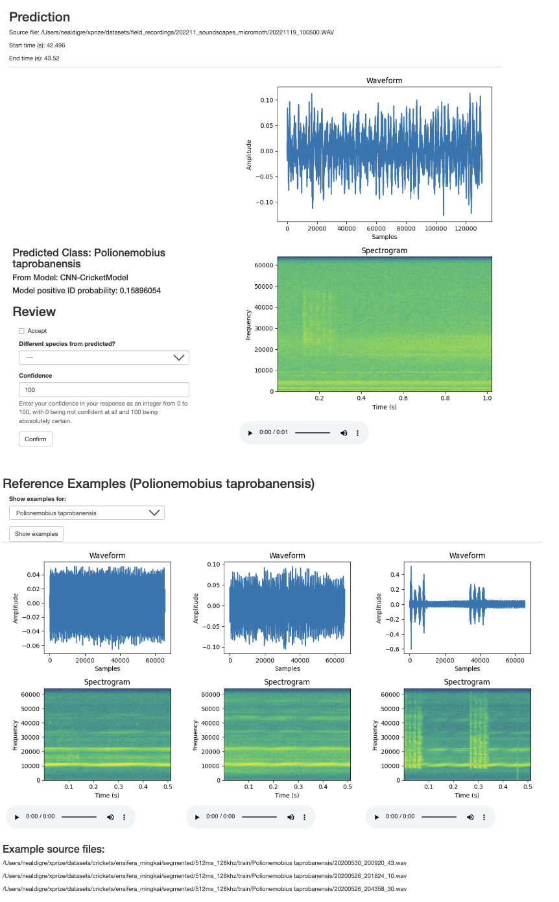

# xprize-songs

Data and code for 
[XPRIZE Rainforest](https://www.xprize.org/prizes/rainforest) 
song identification -- **Team Waponi**

## Data
Training data consists of over 8 hours of audio recordings 
of Orthopterans, provided by Ming Kai Tan, Ph.D.

Labels and general information can be found in the
[data directory](data/crickets/ensifera_mingkai).
The raw audio files are not included here; 
XPRIZE Rainforest is a competition, after all.

## Code

### Model

**Architecture definition**: [model.py](src/model.py)

**Training**: [train.py](src/train.py)

**Inference**: [inference.py](src/inference.py)

### Data Analysis and Preprocessing

Some dataset analysis and plotting: [analysis.py](src/data/analysis.py)

Main preprocessing script to prepare dataset for model training: 
[preprocessing.py](src/data/preprocessing.py)

Audio transformation utility functions,
e.g. convert to spectrogram or split into windows: 
[transform.py](src/data/transform.py)

### Prediction Review Flask App

A (very) rough first implementation for a Flask App to
review model predictions is located at [src/review](src/review).

An example screenshot for the UI is provided below.

## TODOs
* Implement prediction for other taxonomic levels, e.g. order, genus.